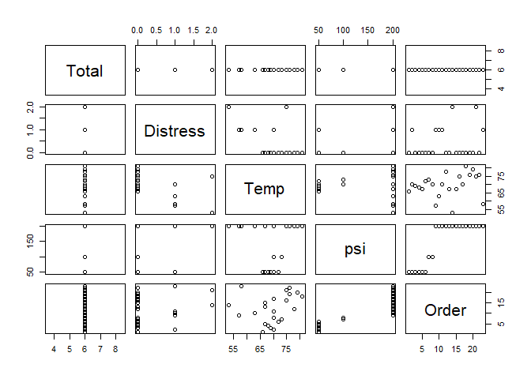
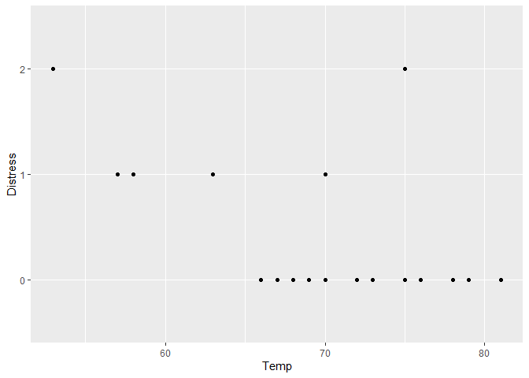
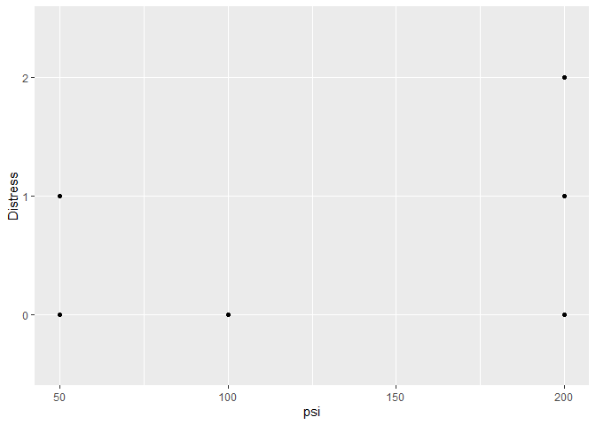
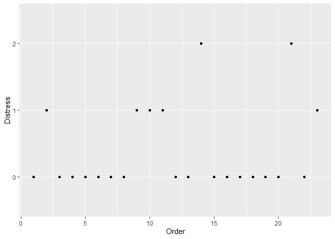
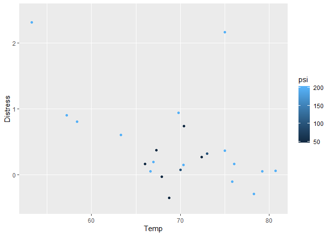
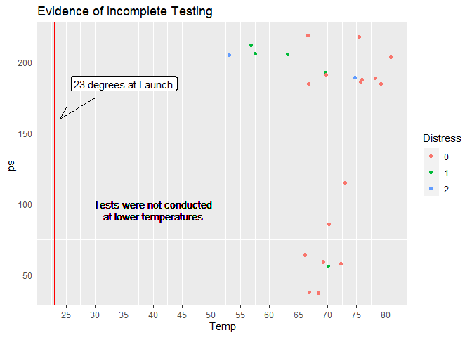

## R Markdown

This is an R Markdown document. Markdown is a simple formatting syntax
for authoring HTML, PDF, and MS Word documents. For more details on
using R Markdown see <http://rmarkdown.rstudio.com>.

When you click the **Knit** button a document will be generated that
includes both content as well as the output of any embedded R code
chunks within the document. You can embed an R code chunk like this:

``` r
data <- fread("C:/Users/le/Desktop/GDAT515/lle-assignment3/lle-assignment3/challengerdata.csv")

data <- data %>% mutate(
  Distress = as.character(Distress)
)

summary(data)
```

    ##      Total     Distress              Temp            psi       
    ##  Min.   :6   Length:23          Min.   :53.00   Min.   : 50.0  
    ##  1st Qu.:6   Class :character   1st Qu.:67.00   1st Qu.: 75.0  
    ##  Median :6   Mode  :character   Median :70.00   Median :200.0  
    ##  Mean   :6                      Mean   :69.57   Mean   :152.2  
    ##  3rd Qu.:6                      3rd Qu.:75.00   3rd Qu.:200.0  
    ##  Max.   :6                      Max.   :81.00   Max.   :200.0  
    ##      Order     
    ##  Min.   : 1.0  
    ##  1st Qu.: 6.5  
    ##  Median :12.0  
    ##  Mean   :12.0  
    ##  3rd Qu.:17.5  
    ##  Max.   :23.0

## EDA

``` r
plot(data)
```

<!-- -->

``` r
ggplot(data, aes(Temp, Distress))+
  geom_point()
```

<!-- -->

``` r
ggplot(data, aes(psi, Distress))+
  geom_point()
```

<!-- -->

``` r
ggplot(data, aes(Order, Distress))+
  geom_point()
```

<!-- -->

``` r
ggplot(data, aes(Temp, Distress))+
  geom_jitter(aes(color = psi))
```

<!-- -->

``` r
ggplot(data, aes(Temp, psi))+
  geom_jitter(aes(color = Distress))+
  geom_vline(xintercept = 23, color = "red")+
  scale_x_continuous(breaks = seq(0, 100, 5))+
  geom_segment(aes(x = 30, y = 175, xend = 24., yend = 160),
               arrow = arrow(length = unit(0.5, "cm")))+
  annotate("label", x = 35, y = 185, label = "23 degrees at Launch")+
  geom_text(x = 40, y = 100, label = "Tests were not conducted") +
  geom_text(x = 40, y = 92, label = "at lower temperatures")+
  ggtitle("Evidence of Incomplete Testing")
```

<!-- -->
